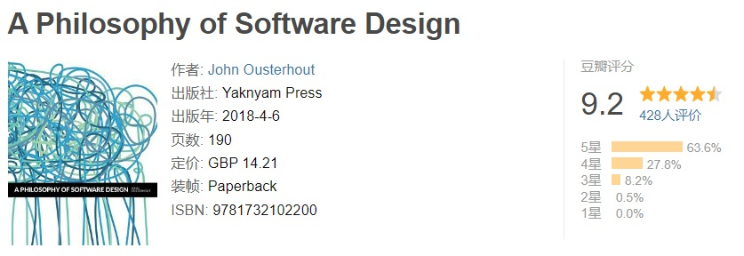

[](https://github.com/yingang/aposd-zh/actions/workflows/CI.yml)
# 《软件设计的哲学》中文翻译

在线阅读：[简体中文](https://yingang.github.io/aposd-zh/) | [繁体中文](https://yingang.github.io/aposd-zh/zh-tw/)

## 简介



这本书是关于软件设计的：如何将复杂的软件系统分解成模块（如类和方法），以便这些模块可以相对独立地实现。首先，这本书介绍了软件设计的基本问题，也就是对复杂性的管理。然后，它讨论了关于如何处理软件设计过程的一些哲学问题，并提出了一系列可以在软件设计过程中应用的设计原则。本书还介绍了一些可用来识别设计问题的危险信号。您可以通过应用本书中的想法来减少大型软件系统的复杂性，以便您可以更快地编写软件。

John Ousterhout 是斯坦福大学的 Bosack Lerner 计算机科学教授。他是 Tcl 脚本语言的创建者，并且以在分布式操作系统和存储系统中的工作而闻名。Ousterhout 在耶鲁大学获得了物理学学士学位，并在卡内基梅隆大学获得了计算机科学博士学位。他是美国国家工程院院士，并获得了无数奖项，包括 ACM 软件系统奖、ACM Grace Murray Hopper 奖、美国国家科学基金会总统年轻研究者奖和 UC Berkeley 杰出教学奖。

## 目录

- [前言](docs/preface.md)
- [第 1 章 介绍](docs/ch01.md)
- [第 2 章 复杂性的本质](docs/ch02.md)
- [第 3 章 能工作的代码是不够的](docs/ch03.md)
- [第 4 章 模块应该是深的](docs/ch04.md)
- [第 5 章 信息隐藏和信息泄露](docs/ch05.md)
- [第 6 章 通用的模块是更深的](docs/ch06.md)
- [第 7 章 不同的层级，不同的抽象](docs/ch07.md)
- [第 8 章 下沉复杂性](docs/ch08.md)
- [第 9 章 在一起更好还是分开更好？](docs/ch09.md)
- [第 10 章 通过定义来规避错误](docs/ch10.md)
- [第 11 章 设计两次](docs/ch11.md)
- [第 12 章 不写注释的四个借口](docs/ch12.md)
- [第 13 章 注释应该描述代码中不明显的内容](docs/ch13.md)
- [第 14 章 选取名称](docs/ch14.md)
- [第 15 章 先写注释](docs/ch15.md)
- [第 16 章 修改现有的代码](docs/ch16.md)
- [第 17 章 一致性](docs/ch17.md)
- [第 18 章 代码应该是显而易见的](docs/ch18.md)
- [第 19 章 软件发展趋势](docs/ch19.md)
- [第 20 章 性能设计](docs/ch20.md)
- [第 21 章 结论](docs/ch21.md)
- [总结](docs/summary.md)

## 翻译说明

无意中看到这本书的相关介绍，也很快找到了 GitHub 上的民间翻译版，因为看到一些翻译不太恰当的地方，所以想着顺手提交修正下，然后找到其中 Star 数量比较多的主要是 [Cactus-proj](https://github.com/Cactus-proj/A-Philosophy-of-Software-Design-zh) 和 [Go7hic](https://github.com/Go7hic/A-Philosophy-of-Software-Design) 的，但两者的内容几乎完全一样，包括一些翻译不当的地方也是同样的。从实质内容的提交历史来看，应该 Cactus-proj 是更早的提交者，这一点从各自的 Fock/Star 数量也能侧面印证。

这两个项目均有收到并处理一些内容修正的 PR，但即使是 Cactus-proj，最新的几个 PR 也处于较长时间未处理的状态，推测都已经暂停维护了，然后基于 Cactus-proj，包含内容修复最多的是 [luojiego](https://github.com/luojiego/A-Philosophy-of-Software-Design-zh) 的 Fork，于是就基于这个创建了自己的 [Fork](https://github.com/yingang/aposd-zh)。除了一边阅读一边校对，也摸索着更新了相关的部署脚本，部署到我自己的 [GitHub Pages](https://yingang.github.io/aposd-zh/) 上，可直接在线阅读。

从提交历史来看，[gdut-yy](https://github.com/gdut-yy) 应该是主要的翻译贡献者，[liquid207](https://github.com/liquid207)、[wanghuanwei](https://github.com/wanghuanwei)、[luojiego](https://github.com/luojiego) 和 [BlackGlory](https://github.com/BlackGlory) 也都贡献了比较多的翻译修正，[inkydragon](https://github.com/inkydragon) 则主要负责了 LaTeX 和 PDF 相关的工作以及格式规范、持续集成等方面的工作，不确定历史是否挖掘充分，所有提到未提到的贡献者，一并感谢！

出于尊重原作版权的考虑，在完整的校订工作完成之后，我删除了与中文并列对照的英文内容，对于纯英文内容也删除了主体部分，只保留了前言以及各个章节的概要和总结。如果您在阅读过程中，发现有翻译不当的地方，或者有其他建议，欢迎提交相应的 PR 或 Issue。

另外，同时还基于 `opencc` 使用 Python 脚本自动生成了繁体中文的翻译版本，也一并放在了 [GitHub Pages](https://yingang.github.io/aposd-zh/zh-tw/) 上，如果发现有处理不当的内容，请针对该脚本或对应的简体中文内容提交 PR 或 Issue。

## 本地开发 & 阅读

本项目基于 VuePress 进行开发，以提供比 Github Markdown 更佳的阅读体验

依赖于 [`node.js`][nodejs]、[`yarn`][yarn]、[`vuepress`][vuepress] 等环境

[nodejs]: https://nodejs.cn/
[yarn]: https://yarnpkg.com/
[vuepress]: https://v2.vuepress.vuejs.org/zh/

```sh
git clone https://github.com/yingang/aposd-zh.git
cd aposd-zh/
yarn install    # 安装 VuePress@next
yarn dev        # 编译并打开网页预览
```

## License

[MIT](./LICENSE)
